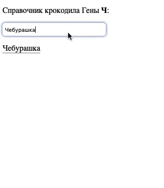

# Выпадающий список с поиском

Домашнее задание к занятию 2.2 «Работа с HTML-формами».

## Описание 

Необходимо __дописать__ удобное управление списком интересов для профиля пользователя.



### Исходные данные

1. Основная HTML-разметка
2. Базовая CSS-разметка
3. Часть написанного кода JS

Реализация представляет собой HTML-обёртку над тегом *select*:

В существующей реализации необходимо доработать метод *getMatches*

```javascript
  getMatches( text ) {
    /*
      TODO: этот метод нужно дописать
      text - фраза, которую вводят в поле поиска
      Метод должен вернуть массив.

      Он формируется на основе списка опций select-элемента (this.input)
      Подходящие опции - те, чей текст содержит то, что есть в аргументе text
      Необходимо вернуть массив объектов со свойствами:
      {
        text: 'Содержимое <option>',
        value: 'Содержимое атрибута value'
      }
    */
    return [
      {
        text: 'Чубакка',
        value: '1'
      }
    ];
  }
```

В экземпляре класса *Autocomplete* имеется свойство *input*, которое указывет
на тег *select*. Его необходимо использовать для обхода по всем опциям списка.

## Подсказки (спойлеры)

<details>
<summary>Используемые темы</summary>

1. Свойство *options* тега *select*
2. Метод [*includes*](https://developer.mozilla.org/ru/docs/Web/JavaScript/Reference/Global_Objects/String/includes)

</details>

<details>
<summary>Советы</summary>

Для получения всех опций тега *select* достаточно обратиться к *this.input.options*

</details>


### Процесс реализации

1. Допишите метод *getMatches*
2. Получайте удовольствие :) 