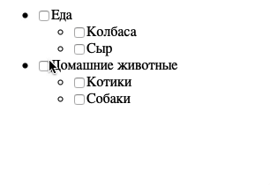

# Дерево интересов

Домашнее задание к занятию 2.2 «Работа с HTML-формами».

## Описание 

Необходимо написать удобное управление списком интересов для профиля пользователя.

### Исходные данные

1. Основная HTML-разметка
2. Базовая CSS-разметка

### Процесс реализации

1. Реализуйте функционал, когда при клике на галочку будут проставляться/сниматься
галочки вложенных списков
2. В этом варианте задаче списки имеют максимум 1 уровень вложенности, поэтому
не нужно делать максимально общее и абстрактное решение.

### Повышенный уровень сложности (не обязательно)

Необходимо добавить функционал:

1. Простановка интересов должна работать на неограниченный уровень вложенности
2. Простановка галочек должна производиться как вниз, так и вверх по дереву
(если выбраны все дочерние элементы, нужно ставить галочку; иначе снимать)
3. Для дочерних элементов, если выбраны не все галочки, у родителя должно
устанавливаться значение *indeterminate*. Про него вы можете узнать более подробно
[тут](https://css-tricks.com/indeterminate-checkboxes/) и 
[тут](https://ruseller.com/lessons.php?rub=28&id=1214)

## Подсказки (спойлеры)

Используемые темы

1. Свойства *checked* и *indeterminate* 
2. Методы *closest*, *querySelector* и *querySelectorAll*
3. [Рекурсия (для повышенной сложности)](https://learn.javascript.ru/recursion)

Советы

В задаче на повышенный уровень сложности довольно легко из-за рекурсии 
переполнить стек вызовов. Внимательно следите за тем, чтобы проверки на наличие
галочек вверх по дереву не шли обратно вниз.

